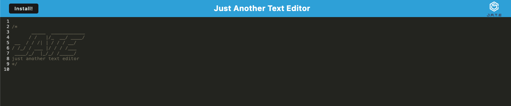
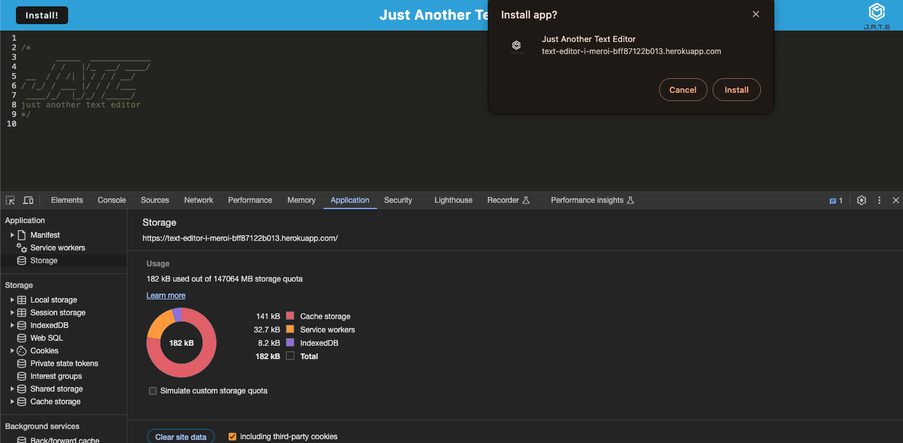

# text-editor
## Description
This project is a text editor that runs in the browser and meets the PWA criteria. It's a single-page application that allows data to persist even if the options are not supported by the browser or if there's no internet connection. The text editor can also be installed as a Progressive Web Application.

## Link
https://text-editor-i-meroi-bff87122b013.herokuapp.com/

## Screenshots

## Installation
N/A

## Usage
In order to use this application, an user can click in the link provided above and start typing. The data will be automatically saved for later use, even if the user is offline. The app can be installed by clicking in the Install button and saved in the computer.

## Credits
I was able to create this code thanks to the help of the TA, tutors and old codes that were given to us as learning tools.

## License
Please refer to the repository for more info regarding the license.
